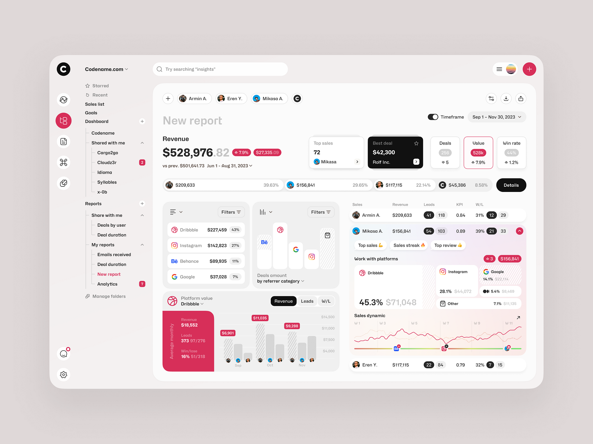

# Acorn Globus Full Stack Developer Intern Assignment

## Dashboard UI Development - Pixel Perfect Recreation

This project is my submission for the Full Stack Developer Intern position at Acorn Globus. The assignment required recreating a provided dashboard design with pixel-perfect accuracy using HTML, CSS, and JavaScript.

### 🎯 Assignment Objective

Recreate the provided dashboard design with pixel-perfect accuracy, focusing on:

- Layout and spacing
- Typography and font sizes  
- Colors and gradients
- Icons and visual elements
- Hover states and micro-interactions
- Desktop responsiveness (minimum 1280px width)

### 🖼️ Dashboard Design



### 🛠️ Tech Stack

- **Frontend Framework**: React with TypeScript
- **Build Tool**: Vite
- **Styling**: Tailwind CSS with shadcn/ui components
- **Charting**: Recharts for data visualization
- **State Management**: React hooks and context

### 📁 Project Structure

```
src/
├── components/
│   ├── dashboard/
│   │   ├── Header.tsx           # Main header with user info
│   │   ├── Sidebar.tsx          # Navigation sidebar
│   │   ├── DashboardHeader.tsx  # Dashboard title and filters
│   │   ├── RevenueHero.tsx      # Revenue summary cards
│   │   ├── ProgressSection.tsx  # Progress indicators
│   │   ├── PlatformFilters.tsx  # Platform selection filters
│   │   ├── BarChartSection.tsx  # Main revenue chart
│   │   ├── QuickMetrics.tsx     # Quick performance metrics
│   │   ├── PerformanceTable.tsx # Detailed performance data
│   │   └── DeepDiveAnalytics.tsx # Advanced analytics section
│   └── ui/                      # Reusable UI components
└── pages/
    └── Index.tsx               # Main application page
```

### 🎨 Design Implementation

The implementation focuses on pixel-perfect accuracy with attention to:

- **Typography**: Precise font sizes, weights, and spacing
- **Colors**: Exact color matching from the design reference
- **Layout**: Grid-based layout ensuring proper alignment
- **Interactions**: Smooth hover effects and transitions
- **Responsiveness**: Clean desktop experience with 1280px+ support

### 🚀 Features Implemented

- **Revenue Overview**: Hero section with key metrics
- **Progress Tracking**: Visual progress indicators
- **Platform Filtering**: Interactive platform selection
- **Data Visualization**: Bar charts for revenue analysis
- **Performance Metrics**: Quick stats and detailed tables
- **Deep Analytics**: Advanced data breakdowns

### 📱 Responsive Design

- Desktop-optimized (1280px minimum width)
- Flexible grid layout
- Proper spacing and typography scaling
- Touch-friendly interactions where applicable

### 🔧 Development Setup

```bash
# Clone the repository
git clone <repository-url>

# Install dependencies
npm install

# Start development server
npm run dev

# Build for production
npm run build
```

### 📋 Code Quality

- Clean, well-structured TypeScript code
- Proper component organization
- Consistent naming conventions
- Comprehensive comments for complex logic
- Accessibility considerations

### 🎯 What This Assignment Demonstrates

This project showcases my ability to:

- Translate design mockups into functional, pixel-perfect interfaces
- Work with modern React and TypeScript
- Implement responsive layouts with Tailwind CSS
- Create interactive data visualizations
- Write clean, maintainable code
- Pay attention to detail in UI implementation

### 📞 About the Internship

This assignment was part of the selection process for Acorn Globus's Full Stack Developer Intern position. While the assignment focused on frontend development, the internship offers hands-on experience with:

- Backend development (Node.js / Python / Ruby On Rails)
- Database management
- API development
- Full stack project work

The frontend skills demonstrated here are considered essential for any full stack developer role.

---

**Note**: This is a frontend-focused assignment submission. Quality and attention to detail were prioritized over speed of completion.